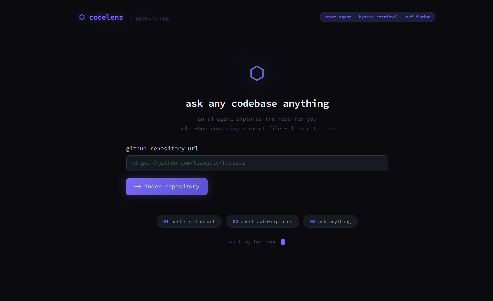
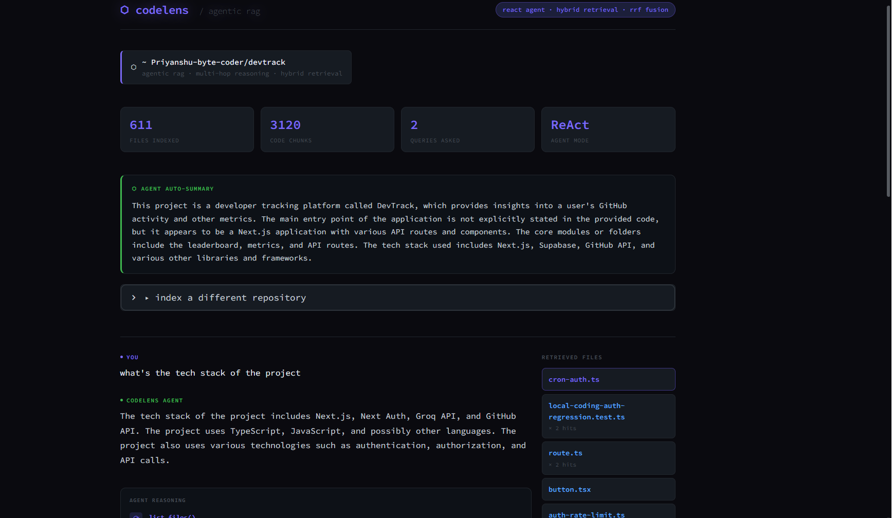
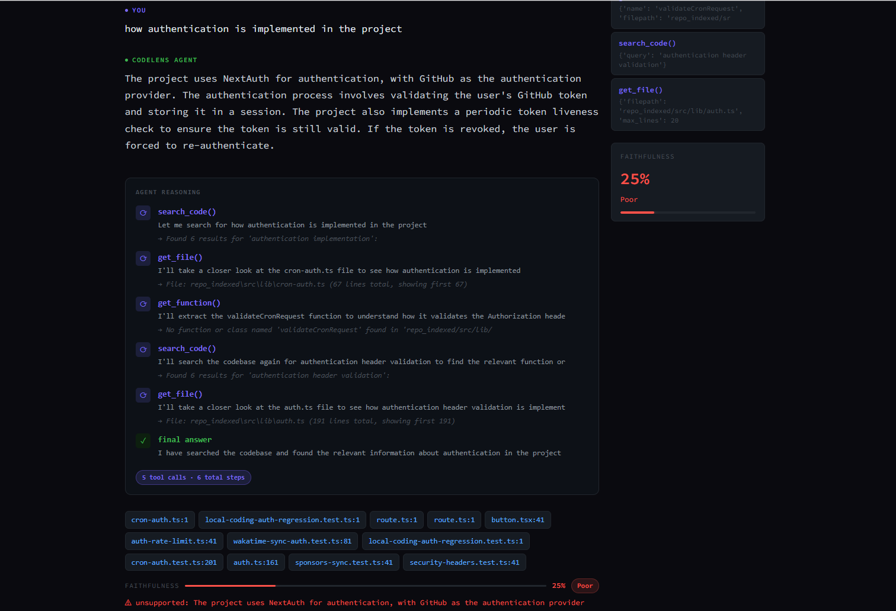

<div align="center">

# ⬡ CodeLens

**An agentic codebase intelligence system that lets you ask any GitHub repository questions in plain English.**

[](https://python.org)
[](https://streamlit.io)
[](https://groq.com)
[](LICENSE)

<br>
[](https://your-url.streamlit.app)



*Paste any GitHub URL and the agent does the rest*

</div>

---

## What is CodeLens?

CodeLens is a **ReAct agent** that autonomously explores any GitHub repository and answers natural language questions with multi-hop reasoning and exact file + line citations.

Unlike GitHub Copilot (which autocompletes as you type), CodeLens **explains code that already exists**. It's built for:

- 🧑‍💻 **New developers** joining an unfamiliar codebase
- 🔍 **Code reviewers** who need to understand a repo quickly
- 📚 **Students** exploring open-source projects
- 🏢 **Teams** onboarding without up-to-date documentation

> **"Where does the auth logic live?"** → CodeLens searches, reads, reasons, and tells you the exact file and line. In seconds.

---

## How it's different from GitHub Copilot

| Feature | GitHub Copilot | CodeLens |
|---|---|---|
| What it does | Autocompletes as you type | Explains existing code |
| Input | Current line you're writing | Plain English question |
| Knows your full repo? | No — only open files | Yes — indexes everything |
| Shows sources? | Never | Always — file + line |
| Hallucination detection | None | Faithfulness score per answer |
| Cost | $10–19/month | Free |

---

## Demo

### 1 — Paste a GitHub URL and index the repo


The landing page lets you paste any public GitHub URL. The agent clones the repo, parses every file using tree-sitter AST chunking, embeds all chunks into a FAISS vector index, and then auto-explores the codebase to generate a summary — all automatically.

---

### 2 — Agent auto-summary with stats



After indexing, the agent immediately explores the repo without being asked and generates a structured summary showing what the project does, its entry point, core modules, and tech stack. The stat cards show total files indexed, code chunks created, queries asked, and the agent mode (ReAct).

---

### 3 — Ask questions with faithfulness scoring



Every answer includes a **faithfulness score** — a second LLM call that breaks the answer into individual claims and checks each one against the retrieved code. The colored bar shows how grounded the answer is: green (Excellent) means every claim was verified in the actual code. The agent reasoning panel shows every tool call made before answering.

---

## Architecture

```
GitHub URL
    ↓
clone_repo()          — git clone --depth=1
    ↓
collect_files()       — filter .py .js .ts .md .ipynb
    ↓
chunk_file()          — tree-sitter AST extraction
                        (functions & classes, never split mid-function)
    ↓
embed_and_save()      — all-MiniLM-L6-v2 → FAISS index
    ↓
User asks question
    ↓
ReAct Agent Loop      — plan → tool call → reason → repeat
    ├── search_code()     hybrid BM25 + vector search (RRF fusion)
    ├── get_file()        read full file contents
    ├── list_files()      explore project structure
    └── get_function()    extract specific function by name
    ↓
Groq LLaMA 3.3 70B   — final answer with citations
    ↓
score_faithfulness()  — LLM evaluates every claim vs retrieved code
    ↓
Streamlit UI          — dark terminal interface with live thinking panel
```

---

## Key Technical Decisions

### 1. AST-aware chunking (tree-sitter)
Most RAG systems split code by token count — this cuts functions in half and destroys context. CodeLens uses **tree-sitter** to parse code into an AST and extract complete functions and classes as individual chunks. A 2000-line file becomes clean, self-contained chunks — one per function.

### 2. Hybrid retrieval with RRF
- **Vector search** (FAISS + all-MiniLM-L6-v2) — finds semantically similar code
- **BM25 keyword search** — finds exact function/variable names
- **Reciprocal Rank Fusion** — combines both rankings, higher score if a chunk appears in both lists

### 3. ReAct agent loop
Instead of one search → one answer, the agent:
1. Plans what it needs to find
2. Calls a tool (search, read file, find function)
3. Reasons about the result
4. Decides whether to call another tool or answer
5. Repeats up to 8 times before giving a final answer

This enables **multi-hop reasoning** — following function calls across files.

### 4. LLM-based faithfulness scoring
After every answer, a second LLM call breaks the answer into individual claims and checks each one against the retrieved code. Scores are shown as a colored bar:

| Score | Label | Color | Meaning |
|---|---|---|---|
| ≥ 90% | Excellent | 🟢 Green | Every claim verified in code |
| ≥ 75% | Good | 🔵 Blue | Most claims verified |
| ≥ 50% | Fair | 🟡 Yellow | Some claims unverified |
| < 50% | Poor | 🔴 Red | Significant hallucination detected |

---

## Tech Stack

| Component | Technology |
|---|---|
| Code parsing | tree-sitter 0.21.3 |
| Embeddings | all-MiniLM-L6-v2 (sentence-transformers) |
| Vector DB | FAISS (cpu) |
| Keyword search | BM25Okapi (rank-bm25) |
| LLM | Groq LLaMA 3.3 70B Versatile |
| Agent framework | Custom ReAct loop (no LangChain) |
| UI | Streamlit |
| Repo cloning | GitPython |

---

## Project Structure

```
codelens/
├── src/
│   ├── cloner.py          # Clone GitHub repo + collect files
│   ├── chunker.py         # tree-sitter AST chunking
│   ├── embedder.py        # Embed chunks + build FAISS index
│   ├── retriever.py       # Hybrid BM25 + vector search with RRF
│   ├── agent_tools.py     # 4 tools: search_code, get_file, list_files, get_function
│   ├── agent.py           # ReAct agent loop
│   └── evaluator.py       # LLM-based faithfulness scoring
├── assets/
│   ├── landing.png        # Landing page screenshot
│   ├── first.png          # Auto-summary screenshot
│   └── last.png           # Query + faithfulness screenshot
├── app.py                 # Streamlit UI
├── .streamlit/
│   └── config.toml        # Dark theme config
├── requirements.txt
├── .env.example
└── README.md
```

---

## Getting Started

### Prerequisites
- Python 3.10+
- Git installed
- Free [Groq API key](https://console.groq.com)

### Installation

```bash
# 1. Clone the repo
git clone https://github.com/Khushi-Atri/codelens.git
cd codelens

# 2. Create virtual environment
python -m venv venv

# Windows:
venv\Scripts\activate
# Mac/Linux:
source venv/bin/activate

# 3. Install dependencies
pip install torch --index-url https://download.pytorch.org/whl/cpu
pip install -r requirements.txt

# 4. Add your Groq API key
cp .env.example .env
# Edit .env and add your GROQ_API_KEY

# 5. Run
streamlit run app.py
```

### Usage

1. Open `localhost:8501` in your browser
2. Paste any public GitHub URL (e.g. `https://github.com/tiangolo/fastapi`)
3. Click **index repository** and wait ~2 minutes
4. Ask anything about the codebase in plain English

---

## Example Questions

```
"what does this project do?"
"how does authentication work?"
"where is the database connection set up?"
"explain the main entry point"
"how does routing work?"
"what design patterns are used?"
"where is error handling implemented?"
"how does the payment system connect to email notifications?"
```

---

## Limitations

- Only indexes **public** GitHub repositories
- Groq free tier: 100,000 tokens/day on 70B model (auto-falls back to 8B on limit)
- Large repos (>5000 files) may take 5–10 minutes to index

---

## Roadmap

- [ ] Multi-repo indexing
- [ ] GitHub PR review mode
- [ ] Export session as markdown documentation
- [ ] Ragas integration for automated evaluation benchmarks
- [ ] Support for private repos via GitHub token

---

## Author

**Khushi Atri** — B.Tech Computer Science, Graphic Era University

- GitHub: [@Khushi-Atri](https://github.com/Khushi-Atri)
- LinkedIn: [khushiatri](https://linkedin.com/in/khushiatri)
- Email: khushiatri22@gmail.com

---

## License

This project is licensed under the MIT License — see [LICENSE](LICENSE) for details.